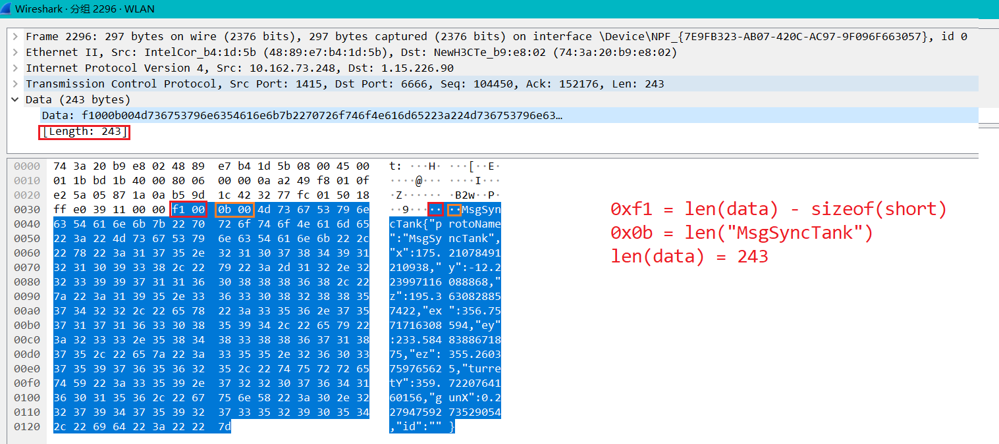

# Tank Game Server

参考《Unity3D网络游戏实战》（第二版）制作的游戏Demo。

相比[原书籍提供的示例代码](https://github.com/luopeiyu/unity_net_book)，本仓库做了符合本人编码习惯的彻底重构，仅供学习参考使用。

这里是服务端Git仓库，客户端位于[此处](https://github.com/MercuryGH/tank-game-client)。

## 部署环境

* Ubuntu 20.04 (x86-64)
* .NET 6.0.201
* MySQL 8.0.28

## 游戏玩法说明和演示

详见客户端仓库的README.md。

## 服务端技术细节

1. 使用MySQL存储玩家账号信息，防御SQL注入。
2. 使用C#异步Socket和轮询`Select`方法管理客户端Socket列表。
3. 使用状态同步方案，JSON格式编码消息内容，简单的长度标识处理TCP粘包半包现象。有简单的反瞬移外挂逻辑。
4. 客户端和服务端的协议类共用一套`sealed class`。

更多文档详见`./doc`。

### 数据包示例

以下是一个同步玩家位置的`sync`包（由客户端发给服务器）的WireShark抓包结果：

## 官方服务器部署在哪里？性能怎么样？

本人的一台腾讯云服务器上，CPU1核、内存2GB。单房间跑个2V2已经能感到明显的卡顿了，甚至有小概率掉线。1V1和1V2则基本没有网络通信问题。

## FAQ

1. 为什么用C#写服务端？

Unity也写C#，两边的网络模块有较大一部分能通用，况且本人C++功底不深（笑）。

不过用了才知道，.NET的Socket API设计比Java好用多了（。

2. 为什么会有概率掉线？

由于掉线事件并非每局游戏都发生，所以排查很困难，推测是服务端忙不过来了，或者发送缓冲区开得太小，`Send` Pong消息失败。

3. 怎么官方服务器又连不上了？

可能是本人在维护，也可能是炸了……出现这种情况，随时开Issue提醒我。

当然，克隆该仓库后用 MySQL + .NET 自行部署，就不用等本人的垃圾服务器重启了。

## TODO:

* 换一台更好的服务器；
* 上手C++服务端编程。

